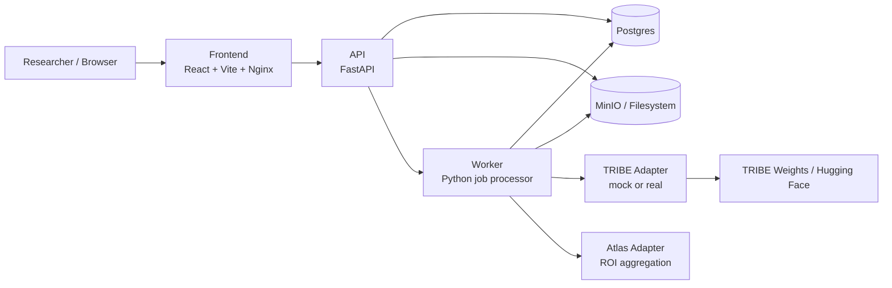

# virtual-subject

`virtual-subject` is a research-facing web application built around TRIBE v2. It turns raw model inference into something inspectable: a workflow where you can submit a stimulus, run prediction, scrub through time, inspect ROI evidence, compare runs, and export reproducible artifacts.

The current local setup works best for text-first exploration. Audio and video support are part of the architecture, but heavier real-mode workloads are better suited to a stronger GPU environment.

Case study: [docs/portfolio-case-study.md](docs/portfolio-case-study.md)

## Project Summary

This project started as an attempt to make a difficult research model usable on a personal machine. The main value is not that it gives a final answer about the brain, but that it makes a complex research model easier to inspect.

What the app does:

- accepts text, audio, or video stimuli
- runs TRIBE-backed cortical response prediction in `mock` or `real` mode
- renders predicted cortical activity on a 3D brain viewer over time
- aligns each frame to the matching text segment, token, or media window
- surfaces ROI evidence, top responding regions, and ROI traces
- supports comparison, exports, and reproducible manifests

This is a research project, not a medical or diagnostic product.

## Why This Exists

Research models are often impressive on paper but hard to operationalize. This repo focuses on the gap between:

- a model that technically runs
- a workflow that a human can actually inspect and reason about

The app is designed to help answer questions like:

- Which regions appear most responsive to a specific passage or phrase?
- How does the predicted response evolve over time?
- How do two inputs differ at the ROI level?
- What artifacts should be saved for later analysis or reproducibility?

## Main Features

- text, audio, and video stimulus ingestion
- run queue with ablation support
- 3D cortical viewer with scrub, rotate, zoom, and fullscreen
- aligned input display per frame
- in-canvas activation and suppression HUD in fullscreen mode
- ROI evidence and top ROI summaries
- ROI trace visualization
- compare runs and inspect contrasts
- export bundles with provenance metadata
- Docker-first local setup

## Typical Use Cases

This should be treated as exploratory research tooling, but it suggests practical directions in:

- marketing and advertising
  compare which wording patterns produce stronger predicted engagement-like responses
- education
  inspect how wording, density, and framing may affect attention or comprehension-related signals
- research tooling
  explore how emotionally loaded or cognitively dense text maps to predicted cortical activity
- AI interpretability
  create brain-inspired inspection workflows around multimodal inference outputs

## Architecture



## How Prediction Flows Through The System

At a practical level, the app works like this:

1. A stimulus is created and stored as text content or uploaded media.
2. The API writes metadata to Postgres and stores larger artifacts in MinIO or filesystem storage.
3. A run request creates a queued background job.
4. The worker claims that job and routes it through the configured TRIBE adapter.
5. The adapter builds an events dataframe from the stimulus.
6. The model returns a `(time, vertices)` prediction tensor.
7. The atlas adapter aggregates those vertex values into ROI summaries and traces.
8. The API serves both high-level summaries and raw viewer-friendly data back to the frontend.

This separation matters because the frontend is not running model logic directly. It is consuming derived artifacts generated by the worker.

## Core Workflow

1. Create a stimulus from text or upload media.
2. Queue a run with one or more ablations.
3. Inspect the cortical viewer, aligned input, ROI evidence, and traces.
4. Compare runs or export the output bundle.

## What A Run Actually Produces

For each run, the system stores and exposes more than a single picture of the brain.

A run can include:

- a timed events dataframe derived from the stimulus
- one or more ablation-specific prediction tensors
- ROI-level frame summaries
- ROI traces over time
- top-responding ROI summaries
- a viewer-ready vertex stream for the 3D canvas
- export artifacts and provenance metadata

For text inputs, the system can align the predicted response to sentence-level or word-level segments so the user can inspect which part of the input is active at each frame.

## Example Demo Setup

One of the most useful text demos is Dylan Thomas's poem:

`Do not go gentle into that good night`

It works well because it is:

- emotionally intense
- linguistically rich
- repetitive enough to inspect temporal change
- short enough to test locally

## Runtime Modes

### Mock Mode

Mock mode is the default. It generates deterministic synthetic predictions so the full product workflow can be exercised without a heavy model download or GPU constraints.

Use mock mode when you want to:

- validate the end-to-end app flow
- test UI behavior
- demo the product structure quickly
- work on a laptop without depending on TRIBE inference

### Real Mode

Real mode uses the upstream TRIBE v2 package and cached weights. This is where text-based local exploration becomes meaningful, but it is also where environment constraints matter most.

Current reality:

- text inference is the most practical path locally
- audio and video workloads are significantly heavier
- a 6 GB laptop GPU is usually not enough for a smooth full multimodal workflow
- real-mode outputs often need lower thresholds than mock-mode outputs to surface useful ROI labels

## Quickstart

### Mock Mode

```bash
git clone <this-repo> virtual-subject
cd virtual-subject
cp .env.example .env
docker compose -f infra/compose.yaml up --build
```

Open:

- frontend: `http://localhost:3000`
- API: `http://localhost:8000`
- MinIO console: `http://localhost:9001`

### Real Mode

Set the following in `.env`:

```env
TRIBE_MODE=real
TRIBE_MODEL_ID=facebook/tribev2
TRIBE_DEVICE=cpu
TRIBE_CACHE_DIR=/app/.cache/tribe
HF_TOKEN=hf_...
```

Then run:

```bash
docker compose -f infra/compose.yaml -f infra/compose.gpu.yaml up -d --build api worker
docker compose -f infra/compose.yaml up -d --build frontend
```

Notes:

- `TRIBE_DEVICE=cpu` is often the only realistic local choice on small GPUs
- first real-mode startup can take a long time because weights and dependencies are cached
- audio/video real-mode inference may still require a stronger remote environment

## Repo Structure

```text
virtual-subject/
  apps/
    frontend/                 React app
  infra/
    compose.yaml             base local stack
    compose.gpu.yaml         real-mode / GPU override
    docker/                  Dockerfiles
  packages/
    atlas-assets/            mesh + ROI metadata
  scripts/
    load_atlases.py          atlas loading utility
    smoke_test.py            API smoke test
  src/virtual_subject/
    adapters/                TRIBE, atlas, storage adapters
    api/                     FastAPI routers and schemas
    db/                      models and DB setup
    domain/                  constants and utilities
    services/                business logic
    web/                     static/template assets
    worker/                  job polling and execution
  tests/                     Python tests
```

## Exports

Each export bundle can include:

- prediction tensors
- ROI traces
- preview image(s)
- manifest metadata for provenance and reproducibility

In practice, exports are useful because they preserve both the visual inspection path and the machine-readable output path.

## Next Steps

- stabilize real-mode audio and video inference in a stronger remote environment such as Runpod
- improve threshold calibration so real-mode activations are easier to interpret out of the box
- add experiment-level batch runs instead of single-run workflows only
- improve model/runtime observability for long-running jobs
- add richer narrative summaries of what changed across frames and ROIs
- separate research-oriented UI from demo/showcase UI

## Current Caveats

- not a clinical or diagnostic system
- predictions are average-subject, model-derived signals
- outputs are easier to inspect than to validate causally
- local hardware constraints still limit the multimodal real-mode path
- some parts of the real multimodal path still belong on a stronger remote GPU environment rather than a laptop

## License

Application code in this repo: MIT.

Upstream TRIBE v2 model and weights: follow the upstream license and usage restrictions. For practical purposes, treat this as research-only unless your intended use is explicitly permitted by the upstream terms.
